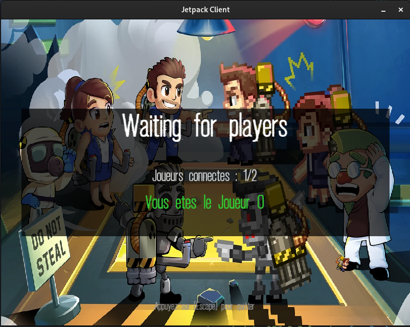
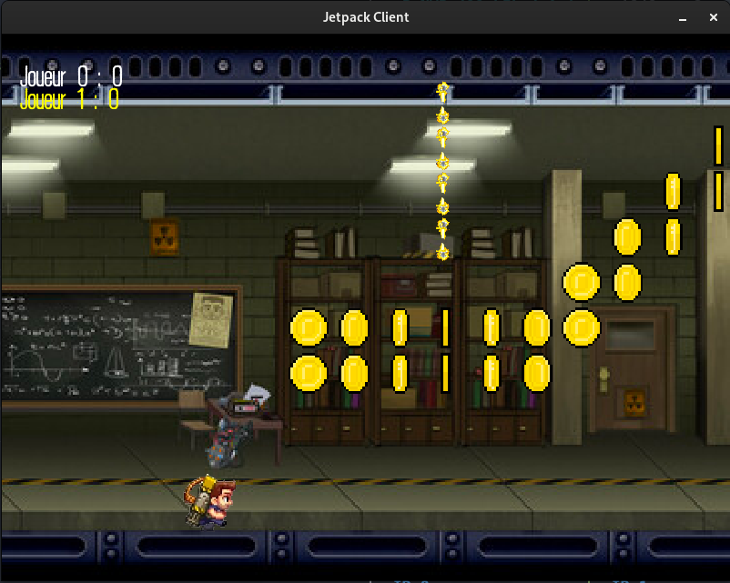
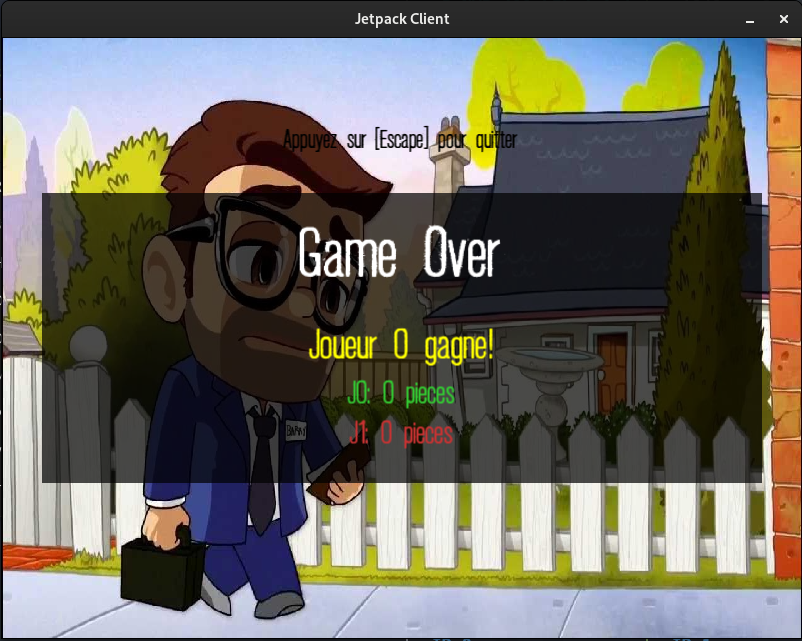

# 🚀 Jetpack Multiplayer

This project is a networked multiplayer game inspired by *Jetpack Joyride*, where players compete on a horizontally scrolling 2D map. Players must avoid traps (zappers), collect coins, and survive longer than others to win the game.

## 📡 Protocol

The multiplayer interaction in Jetpack is based on a **custom TCP protocol**.

TCP is used to ensure **reliable**, **ordered**, and **connection-based** communication between the client and the server—making it a suitable choice for a real-time multiplayer game where player actions, game states, and synchronization must be preserved with accuracy.

The exact protocol design, including all packet types, message formats, and communication rules, is described in the dedicated file:

📄 `doc.txt`

This file outlines how the server and client exchange information throughout the game lifecycle, from login to game over.
## 🗺️ Creating Your Own Map

To customize the game, you can easily create your own map by editing a plain `.txt` file using specific characters. The map is a grid of characters where each character represents a tile or game element.

#### Supported Tiles

| Character | Meaning              |
|-----------|----------------------|
| `_`       | Empty space          |
| `c`       | Coin                 |
| `e`       | Zapper (Obstacle)    |
| `\n`      | New line (row break) |

#### Example

Here is a basic map layout:

```txt
____________________________e__________________________________________________________________
____________________________e_____ccccccc________________________eeeeeeeeeeee__________________
____________________________e____cc____________________________________________________________
____________________________e___cc______e_________________________cccc_________________________
_______________________________cc_______e_________________________cccc_________________________
_________________________ccccccc________e______________________________________________________
_________________________cccccc_________e_________________eeeeeeeeeeeee________________________
________________________________________e______________________________________________________
________________________________________e______________________________________________________
_______________________________________________________________________________________________
```

- The player starts at the **bottom-left**.
- Each new line defines a new **row** in the map from **top to bottom**.

#### Rules

- You can have **up to 10 rowq** (vertical height).
- All rows should ideally have the **same length** (horizontal width) for better display.
- The map must end with a newline `\n` (empty line at the end of the file).
- Only the characters `_`, `c`, `e`, and `\n` are allowed. Any other character will cause a parsing error.


## How to Run

To build the project, run:

```bash
make
```

### Launch the Server

```bash
./jetpack_server -p <port> -m <map_file> [-n <number_of_players>] [-d]
```

- `-p <port>`: the port to listen on (required)
- `-m <map_file>`: path to the map file (required)
- `-n`: (optional) expected number of players (default is 2, max 9)
- `-d`: enable debug mode (optional)

### Launch a Client

```bash
./jetpack_client -h <ip_address> -p <port> [-d]
```

- `-h <ip>`: the server IP address
- `-p <port>`: the port used by the server
- `-d`: enable debug output for the client (optional)

---

## Gameplay Overview

- Players appear on the same scrolling map.
- Press `SPACE` to jump and avoid obstacles.
- Collect coins to increase your score.
- If you touch a zapper or go out of bounds, you're eliminated.
- When only one player is alive or the map ends, the game ends.
- The winner is the player with the most coins.

### Screenshots

Waiting Room:



In-game (running and avoiding zappers):



Game Over screen:



---

## Debug Mode

Using the `-d` flag on both server and client enables debug logging:

- Server will print received packets, sent updates, and player events.
- Client will show incoming updates and acknowledgments from the server.

This is useful for development, testing, and protocol inspection.

---
